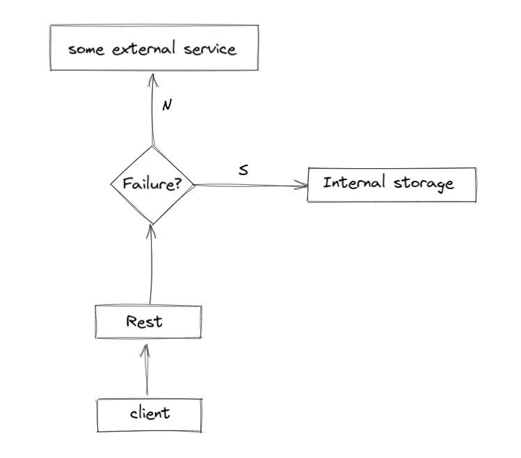

# City discovery is a normal spring-boot application developed in kotlin

    The intention is to provide a list of german cities and their geolocation by using
    two sources:
        a. Some 3° Part service
        b. Local storage created based on the list of cities avaliable by Destatis Statistisches Bundesamt 

Obs: This application is part of my self learning about koltin, so it has no commercial intention

## Design
#### Patterns:
* [CircuitBreaker](https://martinfowler.com/bliki/CircuitBreaker.html) implemented with [Resilience4J](https://docs.spring.io/spring-cloud-circuitbreaker/docs/current/reference/html/#configuring-resilience4j-circuit-breakers)
* [Dependency Injection](https://en.wikipedia.org/wiki/Dependency_injection#:~:text=In%20software%20engineering%2C%20dependency%20injection,leading%20to%20loosely%20coupled%20programs.) implemented with [SpringFramework](https://spring.io/)

#### Layers:



## Installing dependencies
```bash
./gradlew build
```

## Tests and checks
To run all tests:
```bash
./gradlew test
```

## Run locally
```bash
./gradlew bootRun
```

## Resources:
###### Fetch all cities and their geolocation
```bash
curl -X 'GET' 'http://localhost:8080/cities' -H 'accept: */*'
```

| Metric   				                                                                                                | Description    							|
|--------------------------------------------------------------------------------------------------------------------------|--------------------------------------------|
| [findAllCitiesFallBack](http://localhost:8081/actuator/circuitbreakerevents/findAllCitiesFallBack)	| Show status of circuit  	                  |


Links:
* [Destatis Statistisches Bundesamt](https://www.destatis.de/DE/Themen/Laender-Regionen/Regionales/Gemeindeverzeichnis/Administrativ/Archiv/GVAuszugQ/AuszugGV3QAktuell.html)
